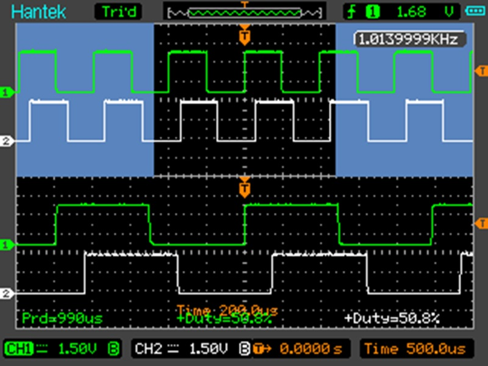
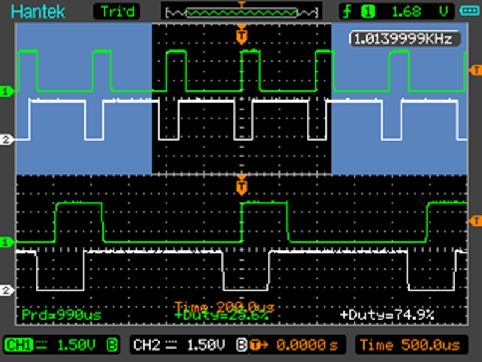
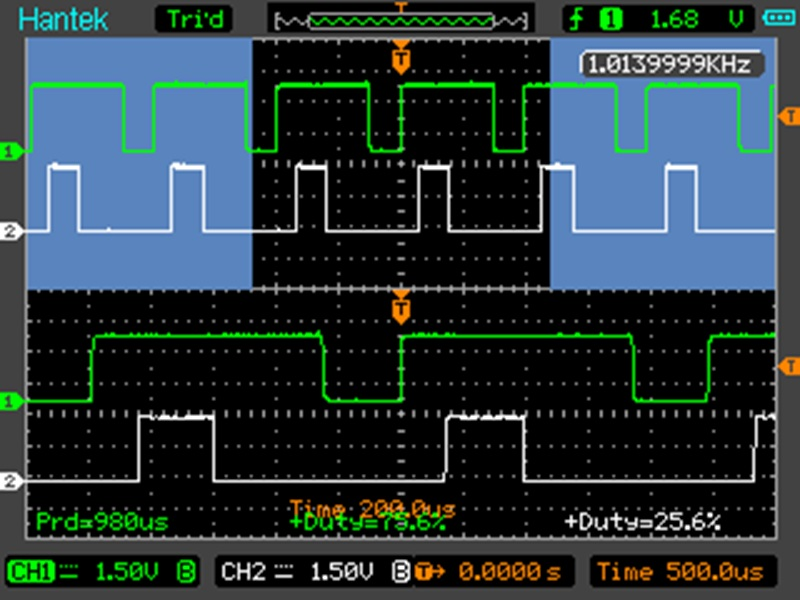

# lib-pwm
Library for controlling pwm output
  
**Example of the output (w/o and w/ debug logs):** 
pi@raspberrypi:\~/git/lib-pwm/build $ ./examples/rpi/pca9685/prog 50 1000 0 
PWMs scenario started 
[INFO][bool sysfs::lnx::Sysfs::Handler::create()] Created node: /sys/class/pwm/pwmchip2/pwm0 
[INFO][pwm::rpi::pca9685::Pwm::Handler::Handler(const pwm::rpi::pca9685::config_t&)] Created pwm [id/polarity/freq/period/duty]: 0/0/1000/1000000/50.000000 
[INFO][bool sysfs::lnx::Sysfs::Handler::create()] Created node: /sys/class/pwm/pwmchip2/pwm1 
[INFO][pwm::rpi::pca9685::Pwm::Handler::Handler(const pwm::rpi::pca9685::config_t&)] Created pwm [id/polarity/freq/period/duty]: 1/0/1000/1000000/50.000000 
PWMs initiated 
Press [enter] 
Press [enter] 
Press [enter] 
PWMs released 
[INFO][pwm::rpi::pca9685::Pwm::Handler::~Handler()] Removed pwm: 1 
[INFO][bool sysfs::lnx::Sysfs::Handler::remove()] Removed node: /sys/class/pwm/pwmchip2/pwm1 
[INFO][pwm::rpi::pca9685::Pwm::Handler::~Handler()] Removed pwm: 0 
[INFO][bool sysfs::lnx::Sysfs::Handler::remove()] Removed node: /sys/class/pwm/pwmchip2/pwm0 
 
pi@raspberrypi:\~/git/lib-pwm/build $ ./examples/rpi/pca9685/prog 50 1000 1 
PWMs scenario started 
[DBG][uint64_t pwm::rpi::pca9685::Pwm::Handler::periodfromfreq(uint32_t)] Period[0]: '1000000' from freq '1000' 
[DBG][bool sysfs::lnx::Sysfs::Handler::write(const std::string&, const std::string&, bool) const] Written[0]: '0' to 'export' 
[INFO][bool sysfs::lnx::Sysfs::Handler::create()] Created node: /sys/class/pwm/pwmchip2/pwm0 
[DBG][bool sysfs::lnx::Sysfs::Handler::write(const std::string&, const std::string&, bool) const] Written[0]: 'normal' to 'polarity' 
[DBG][uint64_t pwm::rpi::pca9685::Pwm::Handler::periodfromfreq(uint32_t)] Period[0]: '1000000' from freq '1000' 
[DBG][bool sysfs::lnx::Sysfs::Handler::write(const std::string&, const std::string&, bool) const] Written[0]: '1000000' to 'period' 
[DBG][uint64_t pwm::rpi::pca9685::Pwm::Handler::dutyfrompct(double)] Duty[0]: '500000' from pct '50.000000' 
[DBG][bool sysfs::lnx::Sysfs::Handler::write(const std::string&, const std::string&, bool) const] Written[0]: '500000' to 'duty_cycle' 
[DBG][bool sysfs::lnx::Sysfs::Handler::write(const std::string&, const std::string&, bool) const] Written[0]: '1' to 'enable' 
[INFO][pwm::rpi::pca9685::Pwm::Handler::Handler(const pwm::rpi::pca9685::config_t&)] Created pwm [id/polarity/freq/period/duty]: 0/0/1000/1000000/50.000000 
[DBG][uint64_t pwm::rpi::pca9685::Pwm::Handler::periodfromfreq(uint32_t)] Period[1]: '1000000' from freq '1000' 
[DBG][bool sysfs::lnx::Sysfs::Handler::write(const std::string&, const std::string&, bool) const] Written[1]: '1' to 'export' 
[INFO][bool sysfs::lnx::Sysfs::Handler::create()] Created node: /sys/class/pwm/pwmchip2/pwm1 
[DBG][bool sysfs::lnx::Sysfs::Handler::write(const std::string&, const std::string&, bool) const] Written[1]: 'normal' to 'polarity' 
[DBG][uint64_t pwm::rpi::pca9685::Pwm::Handler::periodfromfreq(uint32_t)] Period[1]: '1000000' from freq '1000' 
[DBG][bool sysfs::lnx::Sysfs::Handler::write(const std::string&, const std::string&, bool) const] Written[1]: '1000000' to 'period' 
[DBG][uint64_t pwm::rpi::pca9685::Pwm::Handler::dutyfrompct(double)] Duty[1]: '500000' from pct '50.000000' 
[DBG][bool sysfs::lnx::Sysfs::Handler::write(const std::string&, const std::string&, bool) const] Written[1]: '500000' to 'duty_cycle' 
[DBG][bool sysfs::lnx::Sysfs::Handler::write(const std::string&, const std::string&, bool) const] Written[1]: '1' to 'enable' 
[INFO][pwm::rpi::pca9685::Pwm::Handler::Handler(const pwm::rpi::pca9685::config_t&)] Created pwm [id/polarity/freq/period/duty]: 1/0/1000/1000000/50.000000 
PWMs initiated 
Press [enter] 
 
[DBG][uint64_t pwm::rpi::pca9685::Pwm::Handler::dutyfrompct(double)] Duty[0]: '250000' from pct '25.000000' 
[DBG][bool sysfs::lnx::Sysfs::Handler::write(const std::string&, const std::string&, bool) const] Written[0]: '250000' to 'duty_cycle' 
[DBG][uint64_t pwm::rpi::pca9685::Pwm::Handler::dutyfrompct(double)] Duty[1]: '750000' from pct '75.000000' 
[DBG][bool sysfs::lnx::Sysfs::Handler::write(const std::string&, const std::string&, bool) const] Written[1]: '750000' to 'duty_cycle' 
Press [enter] 
 
[DBG][uint64_t pwm::rpi::pca9685::Pwm::Handler::dutyfrompct(double)] Duty[0]: '750000' from pct '75.000000' 
[DBG][bool sysfs::lnx::Sysfs::Handler::write(const std::string&, const std::string&, bool) const] Written[0]: '750000' to 'duty_cycle' 
[DBG][uint64_t pwm::rpi::pca9685::Pwm::Handler::dutyfrompct(double)] Duty[1]: '250000' from pct '25.000000' 
[DBG][bool sysfs::lnx::Sysfs::Handler::write(const std::string&, const std::string&, bool) const] Written[1]: '250000' to 'duty_cycle' 
Press [enter] 
 
PWMs released 
[DBG][uint64_t pwm::rpi::pca9685::Pwm::Handler::dutyfrompct(double)] Duty[1]: '0' from pct '0.000000' 
[DBG][bool sysfs::lnx::Sysfs::Handler::write(const std::string&, const std::string&, bool) const] Written[1]: '0' to 'duty_cycle' 
[DBG][uint64_t pwm::rpi::pca9685::Pwm::Handler::periodfromfreq(uint32_t)] Period[1]: '0' from freq '0' 
[DBG][bool sysfs::lnx::Sysfs::Handler::write(const std::string&, const std::string&, bool) const] Written[1]: '0' to 'period' 
[DBG][bool sysfs::lnx::Sysfs::Handler::write(const std::string&, const std::string&, bool) const] Written[1]: '0' to 'enable' 
[INFO][pwm::rpi::pca9685::Pwm::Handler::~Handler()] Removed pwm: 1 
[DBG][bool sysfs::lnx::Sysfs::Handler::write(const std::string&, const std::string&, bool) const] Written[1]: '1' to 'unexport' 
[INFO][bool sysfs::lnx::Sysfs::Handler::remove()] Removed node: /sys/class/pwm/pwmchip2/pwm1 
[DBG][uint64_t pwm::rpi::pca9685::Pwm::Handler::dutyfrompct(double)] Duty[0]: '0' from pct '0.000000' 
[DBG][bool sysfs::lnx::Sysfs::Handler::write(const std::string&, const std::string&, bool) const] Written[0]: '0' to 'duty_cycle' 
[DBG][uint64_t pwm::rpi::pca9685::Pwm::Handler::periodfromfreq(uint32_t)] Period[0]: '0' from freq '0' 
[DBG][bool sysfs::lnx::Sysfs::Handler::write(const std::string&, const std::string&, bool) const] Written[0]: '0' to 'period' 
[DBG][bool sysfs::lnx::Sysfs::Handler::write(const std::string&, const std::string&, bool) const] Written[0]: '0' to 'enable' 
[INFO][pwm::rpi::pca9685::Pwm::Handler::~Handler()] Removed pwm: 0 
[DBG][bool sysfs::lnx::Sysfs::Handler::write(const std::string&, const std::string&, bool) const] Written[0]: '0' to 'unexport' 
[INFO][bool sysfs::lnx::Sysfs::Handler::remove()] Removed node: /sys/class/pwm/pwmchip2/pwm0 
